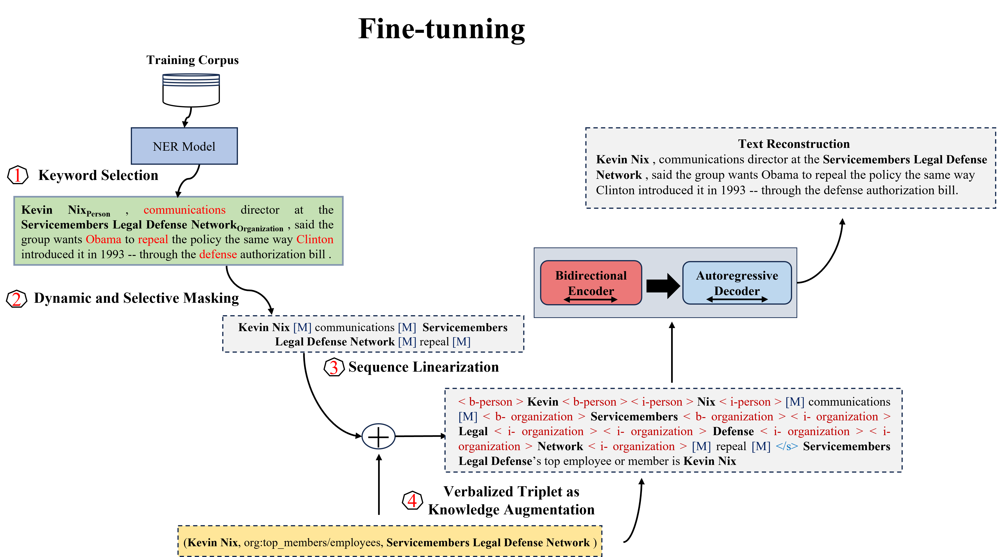
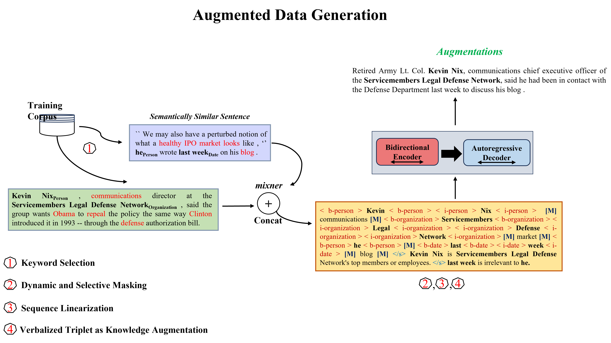

# BioAugforRE



### Dataset
- TACRED: https://nlp.stanford.edu/projects/tacred/
- Re-TACRED: https://github.com/gstoica27/Re-TACRED

```
bioaug4re
 |-- datasets-pre
 |    |-- TACRED
 |    |    |-- tacred_template_relation.json
 |    |-- Re-TACRED
 |    |    |-- tacred_template_relation.json    
 |-- scripts
 |    |-- keyword_extraction.sh
 |    |-- pretrain_dynamic_verbalize.sh
 |    |-- pretrain_dynamic_triplet.sh
 |    |-- test-dynamic_inference.sh
 |    |-- test-dynamic_inference_mixner.sh
 |-- self-training
 |    |-- src
 |    |    |-- self-traing.sh
 |    |-- data
 |    |    |-- relation2id.json
 |    |    |-- test_label_id.json
 |    |    |-- test_sentence.json
 |-- qualitative_measure
 |    |-- qualitative.sh
 |-- SpanBERT-main
 |    |-- data
 |    |-- Model_Training.sh
```

### Steps to generate data augmentations
environment to run > conda create -n env_name python=3.8  

1. 套件安裝:
```
pip install -r requirements.txt
```

2. 對資料集進行指定百分比數分層抽樣，關鍵字提取  
input path:../datasets/${dataset}  
output path:../datasets-pre/${dataset} > train_processed.json, full_train_processed.json  
參數  
size:分層抽樣百分比(整數輸入，轉換為百分比)  
dataset:資料集  
data_type:對何種資料類型(train/dev)  
```
sh keyword_extraction.sh \
    <size (3/10/15/all)> \
    <dataset (TACRED/Re-TACRED)> \
    <data_type(train/dev)> 
```

3. 文本重建模型訓練(Verbailze or original triplet)  
input path:../datasets-pre/${dataset}  
output path:../datasets-pre/${dataset} > train_processed-{}-{}-{}--tokenfix-final  
參數  
size:input path中的資料百分比(模型訓練資料)  
dataset:資料集  
SEED: 42  
```
sh pretrain_dynamic_triplet.sh/pretrain_dynamic_triplet.sh \
    <size (3/10/15)> \
    <dataset (TACRED/Re-TACRED)> \
    <flair_batch_size> 4 \
    <SEED> 42 \
```

4. 數據擴增  
input path:../datasets-pre/${dataset}  
output path:../datasets-pre/${dataset} > model_train${generation_normal}.jsonmix2_inference_ver_filter  
```
sh test-dynamic_inference_mixner.sh/test-dynamic_inference.sh \
    <size (3/10/15)> \
    <dataset (TACRED/Re-TACRED)> \
    <flair_batch_size> 4 \
    <SEED> 42 \
    <generation_normal> 5
```

5. 下游任務RE  
input path:../SpanBERT-main/data  
output path:../SpanBERT-main/results  
```
sh Model_Training.sh
directory:(input)
tacred_dir:(output)
```

* self-training relabel  
input path:../data  
output path:../data > label_data_self_relabel.json  
```
sh self-traing.sh
input_file: step4_output
```

* qualitative_measure diversity, perplexity  
input path:../datasets-pre/${dataset}  
```
* sh qualitative.sh
    <dataset (TACRED/Re-TACRED)> \
    <data_name> step4_output \
```
